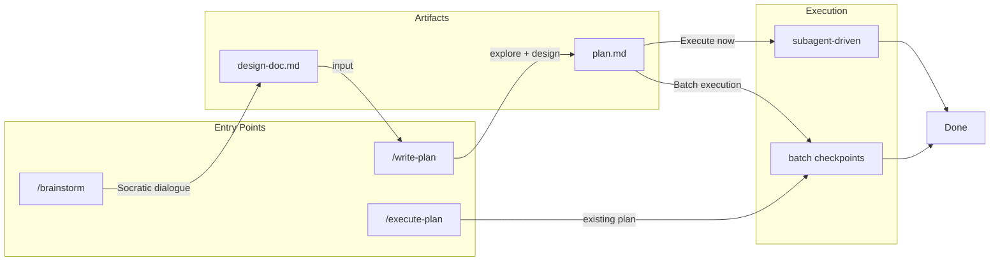

# dev-workflow

Structured development workflow for Claude Code. Enforces TDD, systematic debugging, and verification.



## Why This Plugin

Most plugins add capabilities. This one changes how you work.

**The problem:** Claude is capable but undisciplined. It skips tests, claims "should work now" without verification, fixes symptoms instead of root causes, and accumulates context until it loses track.

**The solution:** A workflow system that enforces discipline through architecture:

| Problem | Solution |
|---------|----------|
| Context pollution | Fresh subagent per task |
| Lost state on crash | Workflow state in files |
| "Should work now" | Verification before any claim |
| Symptom patching | Systematic debugging framework |
| Skipped tests | TDD as methodology, not suggestion |

## Architecture

Built on Claude Code primitives:

```
SessionStart hook
    └── Detects pending work, loads getting-started skill

Task tool
    └── Fresh subagent per task (haiku/sonnet/opus by complexity)

State files (.claude/*.local.md)
    └── Resume across sessions, worktree-scoped

SubagentStop hook
    └── Verifies commit after each task

Stop hook
    └── Warns on incomplete workflow
```

**Token efficiency:**
- Skills loaded on-demand via triggers
- State in files, not conversation
- Subagents keep main context clean
- Model selection per task complexity

**Parallel execution:**
- Git worktrees for isolation
- Each worktree has own state file
- No stepping on each other

## Features

### Skills (13)

| Category | Skills |
|----------|--------|
| Methodology | `test-driven-development`, `systematic-debugging`, `root-cause-tracing` |
| Quality | `verification-before-completion`, `testing-anti-patterns`, `defense-in-depth` |
| Collaboration | `requesting-code-review`, `receiving-code-review` |
| Workflow | `subagent-driven-development`, `using-git-worktrees`, `finishing-a-development-branch` |
| Session | `getting-started`, `condition-based-waiting` |

**Rigid skills** (follow exactly): TDD, debugging, verification
**Flexible skills** (adapt principles): brainstorming, architecture

### Commands

| Command | Purpose |
|---------|---------|
| `/dev-workflow:brainstorm` | Refine idea → design doc |
| `/dev-workflow:write-plan` | Design doc → implementation plan |
| `/dev-workflow:execute-plan` | Plan → code (with checkpoints) |
| `/dev-workflow:workflow-status` | Show current state |

### Agents

| Agent | Purpose |
|-------|---------|
| `code-explorer` | Survey codebase for context |
| `code-architect` | Design implementation approach |
| `code-reviewer` | Review completed work |

## Installation

```bash
claude plugin add pproenca/dev-workflow
```

Or:

```bash
git clone https://github.com/pproenca/dev-workflow ~/.claude/plugins/dev-workflow
```

## Prerequisites

**Required:** `git`
**Optional:** `jq`, `bats-core`, `shellcheck`, `pre-commit`

## Usage

Skills load automatically at session start. The `getting-started` skill establishes the protocol: before any task, check if a skill applies.

State persists in `.claude/dev-workflow-state.local.md`. Sessions can crash and resume.

## Development

```bash
./scripts/setup.sh       # Contributor setup
./scripts/validate.sh    # Full validation
bats tests/              # Test suite
```

## Acknowledgments

Inspired by:

- [anthropics/claude-code](https://github.com/anthropics/claude-code)
- [anthropics/skills](https://github.com/anthropics/skills)
- [obra/superpowers](https://github.com/obra/superpowers)

## License

MIT
